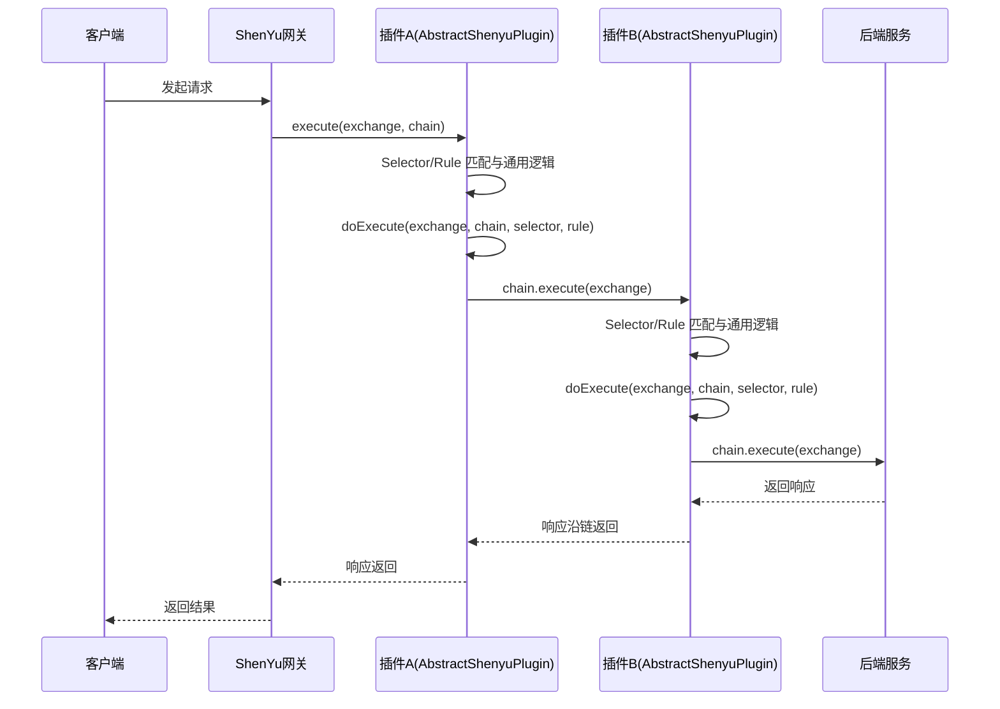
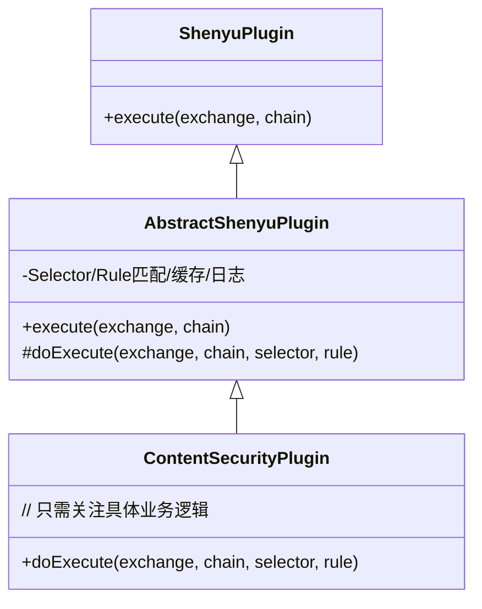
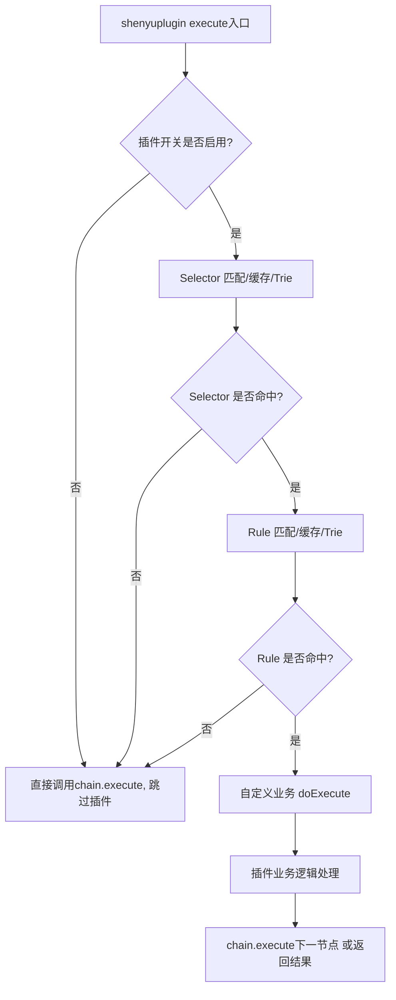
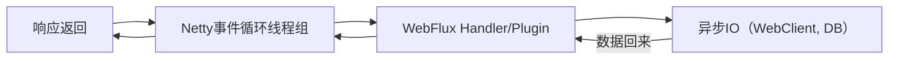

# Shenyu插件开发

## 1.插件体系设计

> ShenYu 网关插件体系基于**模板方法模式**和**责任链模式**，通过 `AbstractShenyuPlugin` 抽象基类，将 Selector/Rule 匹配、缓存、日志等通用流程固化在基类中。开发者只需实现 `doExecute` 方法即可专注于插件核心业务逻辑，极大提升了插件开发的一致性、易用性和可维护性。

### 1.1 插件执行链与入口接口

shenyu插件体系基于经典的**责任链模式**（Chain of Responsibility）， 所有插件都实现统一的接口**ShenyuPlugin**

```java
public interface ShenyuPlugin {
    Mono<Void> execute(ServerWebExchange exchange, ShenyuPluginChain chain);
    int getOrder();
    default String named() { ... }
    default boolean skip(ServerWebExchange exchange) { ... }
    // 还有 before/after 钩子等
}

```

**核心**：每个插件必须实现 `execute` 方法，参数包括当前请求上下文（`ServerWebExchange`）和插件链（`ShenyuPluginChain`），允许插件处理请求并决定是否继续传递给后续插件。

**插件排序**：`getOrder()` 用于确定插件的执行顺序。

**可选方法**：`skip`、`before`、`after` 等，便于插件灵活控制。

1. AbstractShenyuPlugin：**模板方法模式**

   虽然直接实现 `ShenyuPlugin` 足以编写插件，但为统一插件开发范式、简化 Selector/Rule 匹配等通用逻辑，ShenYu 还提供了抽象基类 [`AbstractShenyuPlugin`](https://github.com/apache/shenyu/blob/master/shenyu-plugin/shenyu-plugin-base/src/main/java/org/apache/shenyu/plugin/base/AbstractShenyuPlugin.java)

   **核心思想：**

   - 采用**模板方法模式**（Template Method），把插件执行标准流程抽象封装在 `execute` 方法，**各插件只需实现核心钩子方法 `doExecute`**，专注自身业务。
   - Selector（选择器）、Rule（规则）匹配与缓存、日志、异常处理等通用逻辑由基类自动处理。

   #### 执行流程分解

   1. **插件开关与配置检测**
      - 校验当前插件是否启用（可在admin页面动态控制）。
   2. **Selector 匹配**
      - 基于 URI/path 和缓存/Trie 树查找选择器（Selector），支持多种策略和优先级。
   3. **Rule 匹配**
      - 基于 Selector 查找到所有 Rule，再根据策略查找最合适的 Rule，支持缓存加速与回退机制。
   4. **日志/调试输出**
      - Selector/Rule 命中时自动打日志（方便后续定位和审计）。
   5. **钩子方法调用**
      - 执行抽象钩子方法 `doExecute(exchange, chain, selector, rule)`，插件只需关注业务实现。

### 1.2 设计优点

   - **统一标准，消除重复**：插件开发者不用关注 selector/rule 匹配、缓存、日志等重复劳动，只需聚焦业务代码（doExecute）。
   - **易扩展/插拔**：无论是内置插件还是自定义插件，开发和运维体验完全一致，链式插拔，排序清晰。
   - **高性能**：Trie 缓存、L1/L2 机制保证了大规模规则/选择器下的极致性能。
   - **高度解耦**：每个插件关注点分离，易于测试与维护。

### 1.3 插件责任链执行时序图



### 1.4 自定义插件



### 1.5 模版方法流程图




## 2.自定义内容检测插件

>    ContentSecurityPlugin用于请求的内容安全检测
>
> - **前置检测**：拦截 LLM 代理请求的 prompt（用户输入），异步检测内容是否合规，违规即直接返回错误响应。
> - **后置检测**：对 LLM 响应内容（支持流式 chunk），逐块异步检测，发现违规 chunk 时即时阻断响应。

### 2.1 使用说明

- 开启插件

  

- 配置selector&rule

  

  

- 设置优先级

  通过getOrder方法来定义插件执行优先级，数字越小优先级越高， 在sec的需求中， 需要保证敏感词检测 -> 内容安全检测 -> LLM 代理；

### 2.2 插件逻辑

1. 前置检测（Pre-Check）：拦截请求 Prompt

   ```java
   return DataBufferUtils.join(exchange.getRequest().getBody())
       .flatMap(dataBuffer -> {
           byte[] bytes = new byte[dataBuffer.readableByteCount()];
           dataBuffer.read(bytes);
           DataBufferUtils.release(dataBuffer);
   
           String promptBody = new String(bytes, StandardCharsets.UTF_8);
   
           // 调用三方厂商内容安全检测API（异步WebClient）
           return ContentSecurityChecker.checkText(
                   new ContentSecurityChecker.SafetyCheckRequest(..., promptBody), handle)
               .flatMap(resp -> {
                   String cat = resp.getData().getPromptCategory();
                   if ("违规".equals(cat) || "疑似".equals(cat)) {
                       // 违规 prompt，直接返回错误响应
                       ...
                       return WebFluxResultUtils.failedResult(
                           new ResponsiveException(1400, err, exchange));
                   }
                   // 检测通过，装饰 exchange，进入后续流程
                   ServerWebExchange mutated = exchange.mutate()
                       .request(new ContentSecurityRequestDecorator(exchange, bytes))
                       .response(new ContentSecurityResponseDecorator(exchange, handle))
                       .build();
                   return chain.execute(mutated);
               });
       });
   
   ```

   - 使用 `DataBufferUtils.join` 非阻塞式读取 request body（WebFlux 数据流式读取）。
   - prompt 检测调用 `ContentSecurityChecker.checkText`，底层用 WebClient 实现（完全异步，返回 `Mono`）。
   - 违规直接返回，不通过插件链。
   - 检测通过后，对 exchange request/response 做“装饰”，使后续链条能够继续安全处理。

2. 后置检测（Post-Check）：拦截响应内容

   在ContentSecurityResponseDecorator的具体逻辑中

   ```java
   @Override
   public Mono<Void> writeWith(Publisher<? extends DataBuffer> body) {
       String contentType = getDelegate().getHeaders().getFirst(HttpHeaders.CONTENT_TYPE);
       if (contentType == null ||
               (!contentType.toLowerCase().contains("json") && !contentType.toLowerCase().contains("event-stream"))) {
           return getDelegate().writeWith(body);
       }
   
       // 流式处理每个chunk
       return getDelegate().writeWith(
           Flux.from(body)
               .concatMap(dataBuffer -> {
                   byte[] chunkBytes = new byte[dataBuffer.readableByteCount()];
                   dataBuffer.read(chunkBytes);
                   DataBufferUtils.release(dataBuffer);
                   String chunk = new String(chunkBytes, StandardCharsets.UTF_8);
   
                   // 针对每个chunk都异步调用厂商检测
                   return ContentSecurityChecker
                       .checkText(ContentSecurityChecker.SafetyCheckRequest.forContent(
                           handle.getAccessKey(), handle.getAccessToken(), handle.getAppId(), chunk
                       ), handle)
                       .flatMap(resp -> {
                           String cat = resp.getData() != null ? resp.getData().getContentCategory() : "";
                           if ("违规".equals(cat) || "疑似".equals(cat)) {
                               String errResp = "{\"code\":1401,\"msg\":\"返回内容违规\",\"detail\":\"检测结果：" + cat + "\"}";
                               byte[] errBytes = errResp.getBytes(StandardCharsets.UTF_8);
                               return Mono.just(getDelegate().bufferFactory().wrap(errBytes));
                           } else {
                               return Mono.just(getDelegate().bufferFactory().wrap(chunkBytes));
                           }
                       });
               })
       );
   }
   
   ```

   - 覆写 `writeWith`，对响应流进行二次包装。[注意！在插件处理中， 只要涉及到request/response body的处理， 都需要包装一层， 因为webFlux中， 这些都是一次性的， 消费了后续就拿不到了！]
   - 只对内容类型为 JSON 或 SSE 流（event-stream）生效，静态资源等直接透传。
   - 对每一个 chunk，异步调用内容安全接口。
   - 检测到违规则立刻替换 chunk，输出错误响应。


## 3.高性能异步原理

### 3.1WebFlux/Project Reactor 底层异步机制

- **Reactor 的 Mono/Flux** 并不代表一个线程，而是**描述数据如何异步流转**，只有当有“订阅者”时才真正触发执行。
- **NIO/Netty 驱动**：底层采用 Netty 的 NIO event loop，只有数据到达才回调，不会创建多余线程。
- **IO密集型友好**：任何等待外部IO（API、DB等）都不会拖慢网关主线程，CPU可以充分利用。

shenyu默认全都返回Mono<void>， 为了兼容这份特性， 需要在自定义插件或者逻辑中， 不调用block()， 不return除了Mono\flux外的其他对象， 就不会产生阻塞；



对于咱们项目要求的性能高的特点

- **高并发**：同样资源可支撑几倍乃至几十倍于传统 Servlet 的并发
- **低延迟**：遇到慢操作线程让出，可服务更多并发。
- **横向扩展好**：不会因慢请求导致系统整体处理能力下降。
- **流式友好**：天然支持流式 SSE、大模型响应流，无需等响应体“全到齐”再处理。

### 3.2 shenyu的异步设计

> ShenYu 网关**核心采用 Spring WebFlux**（而不是 SpringMVC）。
> WebFlux 基于 [Project Reactor](https://projectreactor.io/)，是**非阻塞响应式编程模型**，本质是事件驱动+异步回调。
>
> 一句话：ShenYu 的整个请求处理、插件调用链、请求响应数据流，全部是事件驱动和无阻塞的。

- WebFlux 与 Servlet 模型的最大区别

  **Servlet (SpringMVC)**：每个 HTTP 请求会占用一个物理线程（Tomcat/Jetty/NIO线程池），如果有 IO（如远程API调用、数据库、磁盘读写）就会阻塞等待，线程数有限，大量慢请求会拖垮吞吐。

  **WebFlux (Reactor/Netty)**：IO 操作全部异步，每个请求/响应只是一个“信号流”，遇到慢操作时线程可以让出来处理其它请求，响应完成后通过回调/事件机制继续处理后续逻辑。

- ShenYu 插件链的异步设计

  ShenYu 插件的调用是**责任链模式** + **响应式流**，即：

  - 每个插件的 `execute(exchange, chain)` 返回 `Mono<Void>`（或 `Flux<DataBuffer>`，也是响应式类型）。
  - 插件之间通过 `chain.execute(exchange)` 递归传递，只要链上的任一插件返回的是响应式 `Mono`/`Flux`，全链路就是异步的。
  - 插件处理“任务”时，可以随时挂起等待异步结果（比如远程API、数据库等），线程资源不会被占用。

  所以在自定义插件时， 不能有同步操作， 否则会阻塞整个插件调用链， 也可能不兼容整体的响应式编程；**本质**：只要返回的是 Mono/Flux（不是阻塞 return），所有插件和调用链就是**异步且事件驱动**。


### 3.3 ContentSecurityPlugin 的异步实现

- 请求体读取、三方检测：全异步

  `DataBufferUtils.join(exchange.getRequest().getBody())`
   → 返回 `Mono<DataBuffer>`，是响应式异步“聚合”body，不阻塞任何线程，数据到达再回调处理。

  `ContentSecurityChecker.checkText(...)`
   → 内部用 `WebClient`，是 WebFlux 官方 HTTP 客户端，所有网络请求都用 NIO 非阻塞，直接返回 `Mono`，直到检测结果返回时再继续后续逻辑。

- 响应体 chunk 检测：全异步

  - `Flux.from(body).concatMap(...)`
     → 逐个 chunk 异步处理，`concatMap` 保证顺序，处理过程中线程可让渡，无须等所有 chunk 到齐。
  - 每个 chunk 检测同样用 `WebClient`，全异步。

  **本质**：

  - **每个 chunk 都是事件流式到达，检测API也异步，流式写回响应。**
  - 如果 chunk 被判定违规，立刻异步写入错误响应，终止后续流。


## 4.  自定义插件流程

### 4.1 Plugin

定义**XXPlugin** extends AbstractShenyuPlugin， 在doExecute钩子方法里写业务逻辑， 请求和响应都可以进行处理， 注意处理了body需要进行装饰器包装使得后续插件能够重复消费， 并且注意逻辑里不要有同步块的存在；

- 推荐继承 `AbstractShenyuPlugin`，只需关注 `doExecute` 业务。
- `named()` 和 `getOrder()` 决定插件的名称和链上执行顺序。
- `doExecute` 内部可灵活异步调用各种服务，支持 request/response 装饰器。

详情参考ContentSecurityPlugin；

### 4.2 dataHandler

每个插件可自定义实现一个 `PluginDataHandler`，用于处理**动态规则（Rule/Selector）变更、缓存配置解析**等，保证插件运行时读取最新规则。

- 响应规则动态变更（如通过控制台新增、修改、删除规则），保证插件总是用最新配置。
- 典型场景：解析 RuleData 里的 JSON 配置，缓存到内存供插件主流程读取。

详情参考ContentSecurityPluginDataHandler；


### 4.3 Handle&Config

相当于配置实体类， 用于定义selector&rule的具体字段；

详情参考ContentSecurityHandle&ContentSecurityConfig


### 4.4 autoConfiguration

SenYu 插件需要通过 Spring Boot 自动装配机制（通常命名为 `XxxPluginAutoConfiguration`）暴露为 Bean，便于插件体系发现、注册和依赖注入。

插件在shenyu中需要通过自动装配到bootstrap进行使用， 在shenyu-spring-boot-starter模块下新增对应的plugin-starter， 并注入依赖的bean等

详情参考ContentSecurityPluginConfiguration


### 4.5 admin前端页面配置

shenhu-admin的前端插件菜单需要通过sql脚本进行配置， 涉及到的表有：

- plugin： 用于插件声明；
- plugin_handle：对应pluginDataHandler， 存储插件需要的一些字段；
- namespace_plugin_rel： 用于绑定命名空间和插件；
- resource： 菜单表， 用于定义插件详情页面的按钮，输入框等；
- permission：绑定菜单和权限；

详情参考ontentSecurityPlugin在各表中的sql定义；


